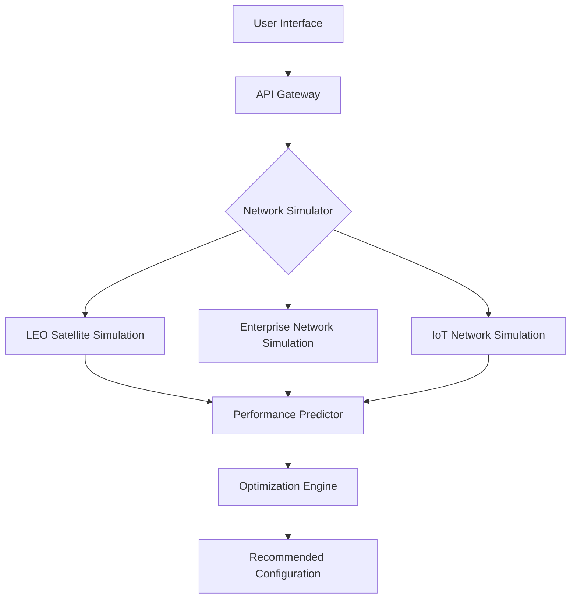
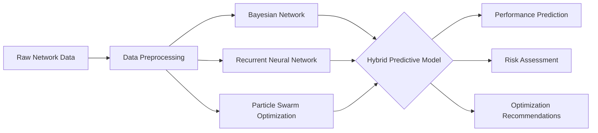

# 🛰️ NetworkTwin: Advanced Network Digital Twin Platform

## 🌐 Overview

NetworkTwin is a cutting-edge network simulation and digital twin platform designed to revolutionize network infrastructure modeling, testing, and optimization.

## 🚀 Key Features

### 🌍 Multi-Domain Simulation
- LEO Satellite Networks
- Enterprise Networks
- IoT Topologies
- Data Center Architectures

### 🤖 Intelligent Capabilities
- AI-Powered Predictive Modeling
- Real-Time Network Dynamics
- Performance Optimization
- Risk Assessment

## 🌈 Architecture Overview

## 📶 Supported Network Types

### 1. LEO Satellite Networks
- Dynamic Constellation Modeling
- Performance Prediction
- Reliability Simulation

### 2. Enterprise Networks
- Multi-Vendor Router Simulation
- Topology Design
- Traffic Modeling

### 3. IoT Networks
- Mesh Network Simulation
- Sensor Connectivity
- Resource Allocation

## 🛠️ Technical Stack

### Backend
- 👉 Python 3.10+
- 🚀 FastAPI
- 📊 PyTorch
- 💍 Bayesian Modeling

### Frontend
- ⚛️ React.js
- 📈 D3.js
- 🎨 Material UI

## 🗺️ Roadmap

### Phase 1: Foundation (Completed)
- [x] Basic Network Simulation
- [x] LEO Satellite Modeling
- [x] Initial Visualization

### Phase 2: Advanced Capabilities (In Progress)
- [x] GNS3 Integration
- [x] WebSocket Real-Time Updates
- [ ] Advanced AI Predictive Models
- [ ] Multi-Cloud Support

### Phase 3: Enterprise-Grade Features (Planned)
- [ ] Kubernetes Integration
- [ ] Advanced Security Modules
- [ ] Enterprise Scalability
- [ ] Comprehensive Monitoring

## 🎓 Predictive Modeling Approach

## 🤝 Contribution

### We Welcome:
- 💻 Network Engineers
- 👀 Research Scientists
- 🌎 Cloud Architects
- 🤖 AI/ML Specialists

## 📞 Contact

**Email**: nabz0r@gmail.com
**GitHub**: [@nabz0r](https://github.com/nabz0r)

## 📜 License

MIT License - Innovation without Boundaries