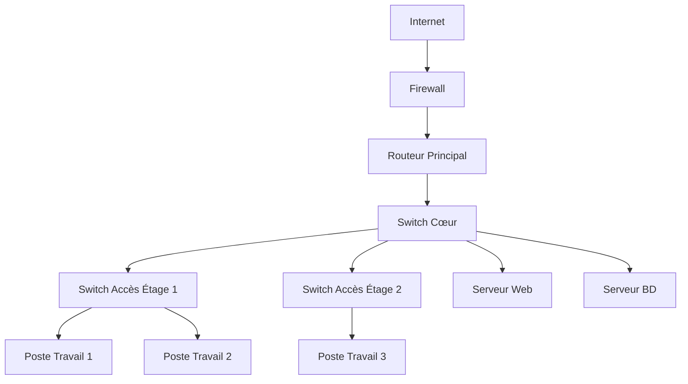
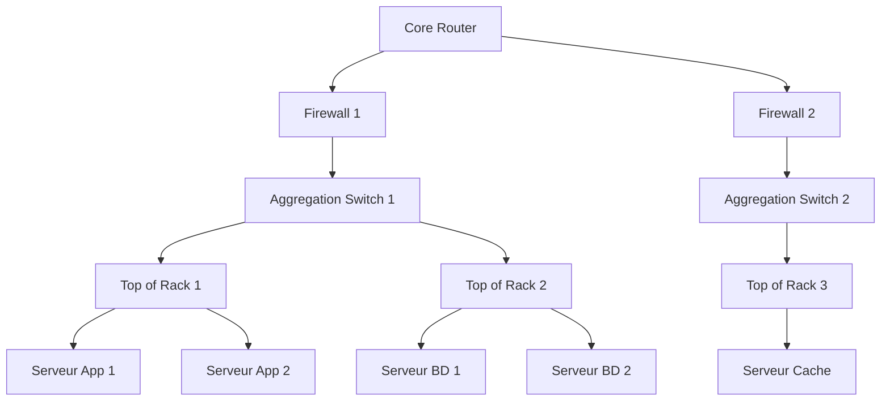
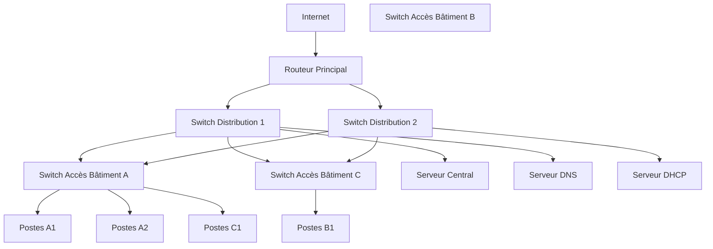
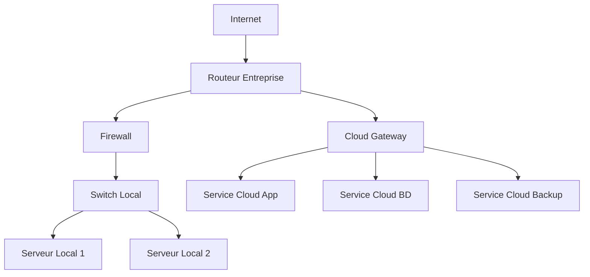
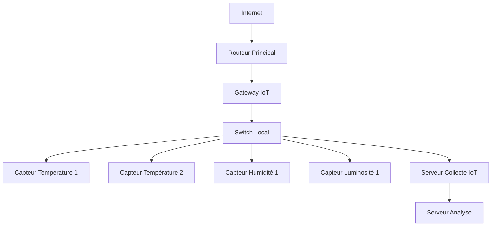

# 🌐 Exemples de Topologies Réseau

## 1. Topologie Entreprise Simple

### Caractéristiques
- Firewall de protection
- Routeur central
- Switch cœur de réseau
- Séparation physique des étages
- Serveurs centralisés

## 2. Topologie Datacenter

### Caractéristiques
- Architecture multiniveau
- Redondance des firewalls
- Switches d'agrégation
- Switches Top of Rack
- Séparation applicative

## 3. Réseau Campus

### Caractéristiques
- Interconnexion de plusieurs bâtiments
- Routeur principal
- Switches de distribution
- Switches d'accès
- Répartition géographique
- Services centralisés

## 4. Topologie Cloud Hybride

### Caractéristiques
- Infrastructure locale
- Connexion cloud sécurisée
- Répartition des services
- Point d'accès unique

## 5. Topologie IoT

### Caractéristiques
- Gateway IoT centralisée
- Collecte multi-capteurs
- Serveur de traitement
- Architecture modulaire

## Points Clés
- Chaque topologie répond à des besoins spécifiques
- Modularité et évolutivité
- Sécurité et redondance
- Adaptation aux contraintes métier

## Recommandations
- Adaptez la topologie à votre contexte
- Pensez à la sécurité et à la performance
- Prévoyez l'évolutivité
- Documentez vos choix d'architecture
